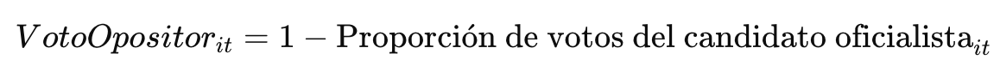
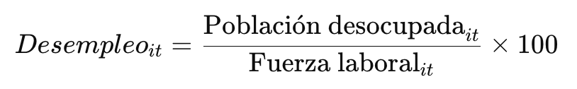

# Efecto del desempleo comunal sobre el voto opositor en Chile: un análisis electoral 2010–2017

- Curso: ICP5006
- Integrantes: María Gracía Abbott, Valentina Tesser y Daniel Trujillo

<details>
  <summary><strong>1. Introducción</strong></summary>
  
## 1. Introducción
La relación entre condiciones económicas locales y decisiones electorales constituye un tema central en la ciencia política, especialmente en el análisis del voto económico. En Chile, los periodos previos y posteriores a las elecciones presidenciales de 2013 y 2017 se caracterizaron por fluctuaciones en las tasas de desempleo comunal y por una alternancia entre coaliciones en el poder. Este proyecto se centra en examinar cómo las variaciones en la tasa de desempleo a nivel comunal influyen en la probabilidad de que los ciudadanos voten por candidatos de oposición, considerando tanto el efecto de castigo hacia el gobierno en funciones como la respuesta de apoyo ante contextos de bonanza económica. Mediante un análisis cuantitativo longitudinal, se busca identificar patrones consistentes que permitan comprender la interacción entre economía local y comportamiento electoral, contribuyendo a la discusión sobre los determinantes del voto en democracias consolidadas y emergentes.

</details>

<details>
  <summary><strong>2. Objetivo</strong></summary>
  
## 2. Objetivo
Analizar cómo las variaciones en la tasa de desempleo comunal influyen en la probabilidad de que los electores voten por candidatos presidenciales de oposición en Chile entre 2010 y 2017, examinando si los cambios en las condiciones laborales previas a las elecciones de 2013 y 2017 se asocian con un voto de castigo o de apoyo hacia el gobierno en ejercicio, en un contexto de alternancia política y transformaciones estructurales del mercado laboral. 

### 2.1 Objetivos específicos 
- Examinar la evolución de la tasa de desempleo comunal en Chile entre 2010 y 2017.
- Describir las variaciones territoriales en el apoyo electoral a los candidatos de gobierno y de oposición en las elecciones presidenciales de 2013 y 2017.
- Estimar el efecto de la tasa de desempleo comunal sobre el voto opositor, controlando por variables sociodemográficas y territoriales.
- Analizar si la relación entre desempleo y voto opositor varía según tipo de comuna, región o ciclo político.

</details>

<details>
  <summary><strong>3. Pregunta de investigación</strong></summary>
  
## 3. Pregunta de investigación
¿En qué medida la tasa de desempleo comunal influye en la probabilidad de que los electores voten por candidatos presidenciales de oposición en Chile entre 2010 y 2017?

</details>

<details>
  <summary><strong>4. Hipótesis</strong></summary>

## 4. Hipótesis
A medida que aumenta la tasa de desocupación en una comuna, dicha comuna tenderá, en promedio, a votar en mayor proporción por la oposición. 

### 4.1 Hipótesis secundarias
- H1: El efecto del desempleo sobre el voto opositor es más fuerte en comunas urbanas que en rurales.
- H2: El impacto del desempleo en el voto opositor se intensifica en contextos de desaceleración económica nacional.
- H3: En comunas con mayores niveles de pobreza o informalidad laboral, el desempleo influye con mayor intensidad en las preferencias electorales. 

### 4.2 Justificación
El período seleccionado (2010–2017) permite observar cómo fluctúan las tasas de desempleo en los años previos y posteriores a las elecciones presidenciales de 2013 y 2017. De esta forma, se podrá analizar si los cambios en las condiciones laborales comunales previas a cada elección se asocian con un voto de castigo o de apoyo hacia el gobierno en ejercicio. Este enfoque busca capturar el impacto de los ciclos económicos y políticos recientes, caracterizados por alternancia de coaliciones y transformaciones estructurales en el mercado laboral.

</details>

<details>
  <summary><strong>5. Diagnóstico del problema</strong></summary>

## 5. Diagnóstico del problema
La literatura sobre comportamiento electoral ha demostrado consistentemente la existencia de una relación entre desempeño económico y resultados electorales, fenómeno conocido como voto económico. En términos generales, los gobiernos tienden a ser castigados cuando la economía se deteriora y recompensados cuando esta mejora (Lewis-Beck y Stegmaier, 2019). Este patrón ha sido ampliamente documentado en democracias consolidadas, donde los votantes actúan como evaluadores retrospectivos del desempeño gubernamental. Sin embargo, en contextos latinoamericanos, y particularmente en Chile, dicha relación parece más ambigua y dependiente de factores institucionales, políticos y sociales. 

En el caso chileno, los estudios de Cerda y Vergara (2009) ofrecen evidencia de un voto económico retrospectivo durante los primeros años de la posdictadura, cuando los niveles de crecimiento y empleo favorecían sistemáticamente a las candidaturas oficialistas. No obstante, investigaciones más recientes, como las de Navia y Soto (2015) o Sáez-Lozano, Jaime-Castillo y Letelier-Saavedra (2014), advierten que la relación entre economía y voto se ha vuelto menos lineal. Factores como la aprobación presidencial, la identificación partidaria y la valoración del liderazgo político tienden a moderar o incluso desplazar el peso del desempeño económico en la decisión electoral. Así, aunque los votantes continúan evaluando la gestión económica, su comportamiento no responde mecánicamente a las variaciones macroeconómicas. 

Pese a este avance, la mayoría de los estudios sobre voto económico en Chile se han concentrado en indicadores nacionales —como el crecimiento del PIB o la inflación— y en la percepción individual del desempeño económico. En cambio, la dimensión territorial del fenómeno ha recibido menor atención. Las diferencias locales en materia de empleo, pobreza o estructura productiva pueden generar dinámicas electorales específicas, especialmente en un país caracterizado por una alta heterogeneidad socioeconómica entre comunas y regiones. En este sentido, el desempleo comunal constituye una variable clave para comprender cómo las condiciones económicas locales moldean las preferencias políticas. 

El período comprendido entre 2010 y 2017 ofrece una oportunidad analítica relevante para examinar este vínculo. Durante estos años, Chile experimentó alternancia política entre coaliciones, fluctuaciones en las tasas de desempleo y episodios de desaceleración económica. Observar cómo evolucionan las tasas de desocupación comunal antes y después de las elecciones presidenciales de 2013 y 2017 permite evaluar si el deterioro del mercado laboral se asocia con un voto de castigo hacia el gobierno o, por el contrario, con la mantención del apoyo oficialista. 

En síntesis, el problema que motiva esta investigación radica en la escasa evidencia empírica sobre el impacto territorial del desempleo en el comportamiento electoral chileno. A diferencia de los enfoques centrados en percepciones nacionales o individuales, este estudio busca examinar cómo las condiciones económicas locales inciden en la probabilidad de votar por la oposición, contribuyendo a una comprensión más desagregada y contextual del voto económico en Chile contemporáneo. 

</details>

<details>
  <summary><strong>6. Marco teórico</strong></summary>

## 6. Marco teórico
El presente estudio se enmarca dentro de la literatura sobre voto económico, que analiza la relación entre el desempeño económico y los resultados electorales. Según ***Lewis-Beck y Stegmaier (2007, 2019)***, los gobiernos tienden a perder apoyo cuando la economía se deteriora y a ser recompensados en periodos de prosperidad. Este patrón, denominado voto económico retrospectivo, es persistente y se observa en múltiples democracias, aunque su intensidad varía según instituciones y sistemas electorales. Los autores distinguen tres enfoques principales: 

1. **Voto económico valencial**: Los votantes evalúan el desempeño económico general del gobierno y premian o castigan sin considerar la ideología del partido ni los programas específicos. Este enfoque refleja la evaluación racional de la gestión económica y constituye la base de la literatura clásica sobre voto económico.
2. **Voto económico posicional**: Inspirado en Stokes (1963), reconoce que los votantes tienen preferencias sobre políticas concretas (como impuestos, redistribución o gasto público), y eligen candidatos cuyas políticas coinciden con sus prioridades, más allá del desempeño global.
3. **Voto económico patrimonial**: Destaca que la riqueza personal y la propiedad de activos influyen en las decisiones de voto, de manera independiente al ingreso o clase social. La evidencia comparada sugiere que quienes poseen más patrimonio tienden a favorecer partidos de derecha.

En conjunto, los tres enfoques ofrecen una comprensión más amplia y matizada del voto económico contemporáneo. Lewis-Beck y Stegmaier (2019) concluyen que, si bien el modelo valencial sigue siendo el paradigma dominante, los enfoques posicional y patrimonial abren nuevas líneas de investigación. A pesar de que las condiciones institucionales pueden modificar la intensidad del voto económico, la relación entre el desempeño económico y los resultados electorales continúa siendo uno de los hallazgos más consistentes y universales de la ciencia política comparada. 

En el contexto chileno, ***Cerda y Vergara (2009)*** profundizan en la tradición del voto económico adaptando sus principales postulados al análisis del sistema político nacional. Los autores sostienen que los votantes actúan como evaluadores retrospectivos que valoran el desempeño económico de los gobiernos y deciden su voto en función de los resultados percibidos. De esta manera, variaciones en indicadores como el crecimiento económico, el desempleo o el gasto público afectan directamente la probabilidad de continuidad del oficialismo. Su planteamiento coincide con la lógica del voto económico valencial descrita por Lewis-Beck y Stegmaier (2007, 2019), al destacar que los electores premian a los gobiernos en periodos de bonanza y los castigan en contextos de crisis o recesión. 

El análisis histórico de Cerda y Vergara muestra que, entre 1989 y 2006, la evolución del ciclo económico se asoció estrechamente a los resultados electorales de la Concertación. Por ejemplo, durante la elección de 1993 —en un contexto de alto crecimiento y bajo desempleo— el candidato oficialista obtuvo un apoyo mayoritario, mientras que en 1999, en medio de una recesión y desempleo elevado, el respaldo al oficialismo se redujo significativamente. Asimismo, los autores identifican que el incremento sostenido del gasto social durante los años noventa no solo contribuyó al bienestar material, sino también a reforzar el apoyo electoral al gobierno, lo que sugiere que las políticas redistributivas generan retornos políticos positivos al modificar las percepciones de bienestar de la ciudadanía. 

A nivel empírico, Cerda y Vergara encuentran una correlación del 93% entre el crecimiento del PIB per cápita y la votación oficialista, lo que confirma la relevancia del desempeño económico en el comportamiento electoral chileno. Estos hallazgos evidencian que el componente económico continúa siendo un factor central para comprender las variaciones en el apoyo al gobierno y a la oposición. No obstante, los autores advierten que, en una economía abierta como la chilena, factores externos —como crisis internacionales o shocks financieros— pueden alterar las condiciones domésticas y, con ello, las dinámicas del voto. Este enfoque ofrece un antecedente empírico clave para investigaciones que buscan analizar, como en el presente estudio, cómo las variaciones en la tasa de desempleo comunal inciden en la probabilidad de votar por candidatos de oposición en contextos de alternancia política. 

Por su parte, el estudio de ***Navia y Soto Castro (2015)*** revisa críticamente la aplicabilidad del modelo clásico del voto económico en Chile entre 1999 y 2013, argumentando que la relación entre desempeño económico y resultados electorales no se cumple de forma sistemática. A partir de encuestas del Centro de Estudios Públicos (CEP), los autores demuestran que las variables más influyentes en la intención de voto por el oficialismo son la aprobación presidencial y la identificación partidaria, más que las percepciones económicas personales o nacionales. Este hallazgo cuestiona la visión tradicional del votante como un actor puramente racional que premia o castiga al gobierno en función del estado de la economía. 

El análisis comparado de las elecciones presidenciales de 1999, 2005, 2009 y 2013 revela que el comportamiento electoral chileno responde más a factores políticos y coyunturales que a indicadores económicos. Casos como la victoria de Ricardo Lagos en 1999, pese al deterioro económico, o el triunfo de Sebastián Piñera en 2009, en un contexto de alta popularidad del gobierno saliente, ilustran esta paradoja. Aunque la percepción sociotrópica retrospectiva —la evaluación general de la economía pasada— conserva cierta relevancia, su efecto es menor en comparación con el de la aprobación presidencial, que actúa como una señal global del desempeño gubernamental. 

Finalmente, Navia y Soto observan que el nivel socioeconómico y la identificación ideológica continúan siendo factores estructurales del voto en Chile: los sectores de menores ingresos tienden a apoyar a la centroizquierda, mientras que los de mayores ingresos favorecen a la derecha. En conjunto, sus resultados indican que el voto económico tiene un peso limitado en el contexto chileno y que las dinámicas políticas e institucionales desempeñan un rol predominante en la configuración de las preferencias electorales. En lugar de un reflejo automático del desempeño económico, el voto presidencial en Chile se entiende mejor como una evaluación política integral, donde la economía constituye solo una parte del juicio ciudadano sobre el gobierno. 

El estudio de ***Sáez-Lozano, Jaime-Castillo y Letelier-Saavedra (2014)*** profundiza en la comprensión del voto económico en Chile desde una perspectiva de racionalidad bajo incertidumbre. Los autores argumentan que, aunque los electores no poseen información perfecta sobre el futuro económico, sus decisiones siguen una lógica racional orientada a maximizar la utilidad esperada. A través del análisis de las elecciones presidenciales de 1993, 1999-2000 y 2005-2006, los resultados indican que el liderazgo político y el contexto electoral tienen un peso mayor que las percepciones económicas individuales en la decisión de voto, lo que refuerza la idea de que las evaluaciones políticas y simbólicas también forman parte del cálculo racional del votante. 

El estudio distingue entre voto sociotrópico y egotrópico, mostrando que los chilenos tienden a evaluar retrospectivamente tanto la economía nacional como su situación personal pasada, sin proyectar necesariamente hacia el futuro. Este hallazgo sugiere que el voto retrospectivo sigue siendo predominante, aunque matizado por elementos de liderazgo y contexto. La combinación de estos factores da cuenta de un electorado informado y estratégico, que integra variables económicas y políticas en su evaluación de los gobiernos salientes. Además, los autores destacan la heterogeneidad del comportamiento electoral chileno, influido por diferencias ideológicas, niveles de ingreso, clase social y educación, lo que evidencia la persistencia de clivajes estructurales en la orientación del voto. 

En conjunto, Sáez-Lozano, Jaime-Castillo y Letelier-Saavedra ofrecen una visión más compleja del voto económico, en la que la racionalidad de los votantes se combina con las limitaciones de información y las particularidades del contexto político. El comportamiento electoral chileno, lejos de responder mecánicamente a las variaciones económicas, se configura como un proceso de evaluación integral que incorpora percepciones sobre liderazgo, desempeño gubernamental y pertenencia social. Este enfoque resulta particularmente relevante para investigaciones que buscan analizar cómo las condiciones laborales, como la tasa de desempleo comunal, pueden incidir en el voto opositor, considerando que los efectos económicos se expresan en interacción con factores políticos e institucionales. 

El estudio de ***Miguel Ángel López (2004)*** amplía la comprensión del comportamiento electoral en Chile al examinar la relación entre clase social, estrato económico y preferencias políticas en el período posterior al retorno a la democracia. A partir del análisis de elecciones presidenciales y parlamentarias entre 1988 y 2001, el autor cuestiona la vigencia de los modelos clásicos —sociológico y de identificación partidaria—, argumentando que el debilitamiento del voto de clase y la disminución de la lealtad partidaria han dado paso a factores coyunturales, como las percepciones económicas y las características personales de los candidatos. Esta transformación, vinculada al proceso de modernización política, refleja una mayor volatilidad y autonomía del electorado popular frente a las coaliciones tradicionales. 

Los resultados del análisis muestran que mientras los trabajadores calificados mantienen una inclinación estable hacia la centroizquierda, los no calificados han exhibido un patrón más fluctuante, con un creciente apoyo a la derecha a partir de la elección de 1999, fenómeno que López denomina “efecto Lavín”. Este cambio se atribuye al peso del liderazgo y la personalización de la política, que ha llevado a los votantes de estratos bajos a valorar atributos como la cercanía, confiabilidad y capacidad de gestión del candidato por sobre la ideología o filiación partidaria. En este sentido, el estudio revela un proceso de realineamiento electoral en el que la racionalidad instrumental y las percepciones inmediatas sustituyen progresivamente a las lealtades ideológicas. 

De esta manera, López muestra que el voto en Chile se ha vuelto más contingente y pragmático, donde las condiciones económicas, los liderazgos personales y las percepciones de desempeño gubernamental configuran una nueva forma de comportamiento electoral. Esta dinámica coincide con los hallazgos de la literatura reciente sobre voto económico, que subraya la interacción entre factores estructurales (como el desempleo o la desigualdad territorial) y factores políticos (como la aprobación presidencial o el liderazgo). 

En síntesis, el marco teórico revisado permite situar la presente investigación dentro de una tradición que busca comprender cómo los contextos económicos influyen en el comportamiento electoral, sin perder de vista los condicionamientos políticos e institucionales. Mientras los estudios clásicos de voto económico (Lewis-Beck y Stegmaier, 2007, 2019; Cerda y Vergara, 2009) destacan la racionalidad económica del votante, investigaciones más recientes (Navia y Soto, 2015; Sáez-Lozano et al., 2014; López, 2004) advierten que dicha racionalidad está mediada por percepciones subjetivas, liderazgo y cambios sociales. En consecuencia, el análisis del efecto del desempleo comunal sobre el voto opositor en Chile entre 2010 y 2017 se inscribe en una línea de investigación que reconoce al votante como un actor racional, pero condicionado por su entorno territorial, sus experiencias económicas y el contexto político de cada elección. 

</details>

<details>
  <summary><strong>7. Metodología</strong></summary>

## 7. Metodología
La investigación adoptará un enfoque cuantitativo con un diseño longitudinal a nivel comunal, abarcando el período 2010–2017, que comprende las elecciones presidenciales de 2013 y 2017. Este rango temporal permite analizar cómo las variaciones en la tasa de desempleo comunal en los años previos y posteriores a cada elección se relacionan con el comportamiento electoral frente a los candidatos de oposición, considerando ciclos políticos y económicos recientes.

El enfoque cuantitativo es apropiado dado que la investigación busca medir la magnitud y dirección del efecto del desempleo sobre el voto opositor, estableciendo relaciones sistemáticas entre variables a lo largo del tiempo.

### 7.1 Unidad de análisis
**Unidad principal**: Comuna.

La comuna constituye la unidad territorial básica de Chile con disponibilidad de datos tanto de empleo como de resultados electorales. Su nivel desagregado permite capturar variaciones locales en la economía y en las preferencias políticas que no serían visibles a nivel regional o nacional. Analizar la comuna permite evaluar si los cambios en las condiciones laborales locales se asocian con un voto de castigo o apoyo hacia el gobierno en ejercicio, abordando directamente la pregunta y los objetivos de la investigación.

### 7.2 Selección y descripción de bases de datos y variables
Para dar respuesta a la pregunta de investigación sobre el efecto de la tasa de desempleo comunal en el voto opositor en Chile entre 2010 y 2017, se seleccionaron dos bases de datos oficiales y confiables, que serán integradas y analizadas a nivel comunal:

1. **Base de datos de ocupación y desocupación (INE)**

Fuente: https://www.ine.gob.cl/estadisticas/sociales/mercado-laboral/ocupacion-y-desocupacion

La base de datos de ocupación y desocupación proporcionada por el Instituto Nacional de Estadísticas (INE) contiene información anual sobre la tasa de desocupación a nivel comunal en Chile. Esta fuente permite construir la **variable independiente principal** del estudio, correspondiente a la tasa de desempleo comunal promedio en el año de cada elección presidencial. Al incorporar esta información, se capturan las condiciones laborales locales que podrían influir en las decisiones de voto de los habitantes de cada comuna, reflejando cómo la situación económica del territorio puede incidir en el comportamiento electoral. La confiabilidad y cobertura nacional de esta base aseguran que el análisis se apoye en datos oficiales y consistentes.

2. **Base de datos de resultados presidenciales (Servel)**

Archivo: resultados_elecciones_presidenciales_ce_1989_2017_Chile.xlsx

Por su parte, la base de datos de resultados presidenciales del Servicio Electoral (Servel), contenida en el archivo resultados_elecciones_presidenciales_ce_1989_2017_Chile.xlsx, registra el porcentaje de votación obtenido por cada candidato presidencial a nivel comunal para las elecciones de 2013 y 2017. Esta información permite medir la **variable dependiente**, es decir, el voto por los candidatos de oposición en cada comuna, que constituye el foco principal de esta investigación. Gracias a la desagregación comunal de los datos, es posible analizar de manera precisa la relación entre las condiciones económicas locales y las preferencias electorales, garantizando un vínculo directo entre las variables de interés y la unidad de análisis definida en el estudio.

3. **Base de datos del Sistema Nacional de Información Municipal (SINIM)**  

La base de datos del **Sistema Nacional de Información Municipal (SINIM)**, administrada por la Subsecretaría de Desarrollo Regional y Administrativo (SUBDERE), reúne información estadística y financiera de los municipios chilenos. Esta fuente proporciona **datos múltiples a nivel comunal**, tales como presupuesto, personal, servicios, infraestructura y características socioeconómicas, los cuales serán utilizados como **covariables de control** en el análisis. Gracias a su nivel de desagregación y cobertura temporal, el SINIM permite incorporar dimensiones estructurales y de gestión municipal que complementan la interpretación de los resultados electorales y las condiciones económicas locales.

**Variables consideradas**:

- **Variable dependiente**: Porcentaje de votación por el candidato de oposición en cada elección presidencial.

- **Variable independiente principal**: Tasa de desempleo comunal promedio del año electoral.
  
- **Variables de control**:
   - Población total de la comuna
   - Densidad poblacional
   - Ruralidad (proporción de población rural)
   - Región
   - Proporción de mujeres
   - Nivel educativo promedio
   - Nivel de ingresos promedio

Estas variables de control permiten aislar el efecto del desempleo sobre el voto opositor, considerando factores sociodemográficos y territoriales que podrían influir en la conducta electoral.

**Modelo econométrico**:

El modelo estimado es el siguiente:

**ΔOppoVoteᵢ,ₜ = γ₀ + γ₁·ΔDesempleoᵢ,ₜ + γ₂·ΔZᵢ,ₜ + uᵢ,ₜ**

**Donde:**
- *ΔOppoVoteᵢ,ₜ*: cambio en el porcentaje de votación por el candidato de oposición en la comuna *i* entre las elecciones *t* y *t−1*.  
- *ΔDesempleoᵢ,ₜ*: cambio en la tasa de desempleo entre los periodos *t* y *t−1*.  
- *ΔZᵢ,ₜ*: cambio en el conjunto de covariables de control entre elecciones.  
- *γ₀*, *γ₁*, *γ₂*: coeficientes del modelo.  
- *uᵢ,ₜ*: término de error.

Esta especificación en primeras diferencias permite comparar cada comuna consigo misma entre elecciones, eliminando todos los factores que son constantes en el tiempo (por ejemplo: preferencias políticas históricas, estructura productiva, composición sociodemográfica estable, etc.). Así, el modelo identifica cómo los cambios en el desempleo dentro de cada comuna se relacionan con los cambios en el comportamiento electoral.

**Integración de las bases de datos:**

Para integrar las tres bases de datos, se utilizará el **identificador único de cada comuna**, lo que permitirá asegurar la coherencia tanto territorial como temporal de la información. Este proceso implicará la normalización de los nombres de las comunas, la estandarización de la codificación de las regiones y la homogenización de los formatos de las distintas variables, garantizando que todos los datos sean compatibles y comparables entre sí. Una vez realizada esta integración y depuración, se construirá un **panel de datos comunal para el período 2010–2017**, que servirá como base para el análisis estadístico. Este panel permitirá evaluar cómo las variaciones en la tasa de desempleo comunal se asocian con los cambios en el voto por la oposición, controlando al mismo tiempo por factores sociodemográficos y territoriales, y asegurando que los resultados reflejen relaciones consistentes y confiables entre las variables de interés.

### 7.3 Estrategia analítica
El análisis se realizará en dos etapas complementarias:

1. **Análisis descriptivo**
   - Se explorará la evolución temporal de las tasas de desempleo y los resultados electorales a nivel comunal entre 2010 y 2017.
   - Se identificarán tendencias, patrones espaciales y correlaciones preliminares entre desempleo y voto opositor.
     
3. **Análisis inferencial**
   - Se estimarán modelos de regresión lineal múltiple (OLS) para evaluar la asociación entre la tasa de desempleo y el porcentaje de votos por la oposición, controlando por las variables sociodemográficas y territoriales.
   - Se incorporarán efectos fijos por región y por año para controlar por diferencias estructurales entre comunas y por ciclos electorales, asegurando que los resultados reflejen variaciones locales de manera más precisa.
   - El análisis se implementará en R, utilizando paquetes estadísticos como lm() para regresión lineal y plm para modelos de panel con efectos fijos, lo que permitirá replicabilidad y trazabilidad del análisis.

De este modo, la combinación de un diseño longitudinal y análisis comunal permite capturar tanto la dimensión temporal (variaciones entre elecciones) como la territorial (heterogeneidad entre comunas) del fenómeno electoral. Además, el uso de regresión múltiple con efectos fijos fortalece la validez interna del estudio, asegurando que las asociaciones identificadas entre desempleo y voto opositor reflejen relaciones plausibles y no sean producto de variables omitidas o de la estructura espacial de los datos.

### 7.4 Procedimiento y herramientas
El análisis de los datos se realizará siguiendo un procedimiento estructurado en cinco pasos principales, asegurando coherencia, trazabilidad y replicabilidad del estudio. Todas las etapas se implementarán utilizando software estadístico R, lo que permitirá la limpieza, integración y análisis de los datos de manera sistemática.

**Paso 1: Selección y depuración de bases de datos**

Se integrarán las tres bases especificadas mediante el identificador único de cada comuna. Durante este proceso se normalizarán los nombres de las comunas, se estandarizará la codificación de las regiones y se homogenizarán los formatos de las variables. El objetivo de esta etapa es asegurar la coherencia territorial y temporal de los datos, garantizando que cada registro comunal corresponda correctamente entre las tres fuentes y que los datos sean comparables.

**Paso 2: Construcción del panel comunal**

Una vez depuradas las bases, se construirá un panel de datos comunal para el período 2010–2017, incluyendo la variable dependiente (voto por la oposición), la variable independiente principal (tasa de desempleo comunal promedio) y las variables de control (población total, densidad, ruralidad, región, proporción de mujeres, nivel educativo promedio y nivel de ingresos). Este panel permitirá analizar tanto la dimensión temporal, observando cambios entre elecciones, como la dimensión territorial, considerando la heterogeneidad entre comunas.

**Paso 3: Análisis descriptivo**

Se realizará una exploración preliminar de los datos mediante análisis descriptivos. Esto incluye la revisión de la evolución temporal de las tasas de desempleo y del voto opositor por comuna, la identificación de tendencias generales, patrones espaciales y posibles valores atípicos. Se utilizarán funciones de R para generar gráficos y resúmenes estadísticos que faciliten la visualización de los datos y la comprensión de la dinámica entre variables.

**Paso 4: Análisis inferencial**

Se estimarán modelos de regresión lineal múltiple (OLS) y modelos de panel con efectos fijos (plm en R) para evaluar la asociación entre la tasa de desempleo y el voto por la oposición, controlando por variables sociodemográficas y territoriales. Se incorporarán efectos fijos por región y por año para controlar diferencias estructurales entre comunas y por ciclos electorales, asegurando que las asociaciones observadas reflejen variaciones locales reales y no sean producto de factores externos o heterogeneidad territorial.

**Paso 5: Presentación y visualización de resultados**

Los resultados se presentarán mediante tablas de coeficientes, intervalos de confianza y gráficos comparativos que ilustren la relación entre desempleo y comportamiento electoral. Esta etapa permitirá comunicar de manera clara y precisa los hallazgos del estudio, facilitando la interpretación de los efectos estimados y su relevancia para la pregunta de investigación.

</details>

<details>
  <summary><strong>8. Plan de análisis</strong></summary>

## 8. Plan de análisis

### 8.1. Propósito general del análisis

El propósito central del análisis empírico es evaluar si las variaciones en la tasa de desempleo comunal influyen en la probabilidad de que los electores voten por candidatos presidenciales de oposición en Chile durante el período 2010–2017.

Para ello, se utilizarán las bases de datos previamente procesadas —ENE (Encuesta Nacional de Empleo (INE)), SINIM (Sistema Nacional de Información Municipal) y Resultados Electorales Presidenciales (SERVEL)—, que permiten construir un panel comunal balanceado y realizar un análisis estadístico multivariado y comparativo.

### 8.2. Construcción de la base de análisis

El primer paso consiste en integrar las tres fuentes depuradas generadas en los scripts:

- `01_df_ENE.Rmd`: contiene la tasa de desempleo comunal (ponderada por el factor fact), elaborada a partir de la ENE, para el período 2010–2017.

- `01_df_presidenciales.Rmd`: registra los porcentajes y proporciones de votos comunales obtenidos por los candidatos ganadores en las elecciones presidenciales de 2013 (Michelle Bachelet) y 2017 (Sebastián Piñera).

- `01_df_SINIM.Rmd`: incluye variables demográficas y estructurales comunales (población total, densidad poblacional, porcentaje rural, porcentaje femenina) para los años 2010–2017.

Estas bases se unirán mediante el identificador comunal y el año, obteniendo un panel comunal-año con la siguiente estructura:

| código | comuna | año | tasa_desempleo | voto_opositor | poblacion_tot | porc_rural | porc_femenina | densidad_pob |

Esta base consolidada será el insumo principal para las regresiones y los análisis descriptivos posteriores.

### 8.3. Definición de variables

**Variable dependiente (Y): voto opositor**

Corresponde a la proporción de votos comunales obtenidos por el candidato presidencial de oposición en cada elección.

Para el cálculo:

- En **2010** (gobierno saliente: Bachelet 1, centroizquierda), el voto opositor se asocia a Sebastián Piñera (centroderecha).
- En **2013** (gobierno saliente: Piñera, centroderecha), el voto opositor se asocia a Michelle Bachelet (centroizquierda).
- En **2017** (gobierno saliente: Bachelet 2, centroizquierda), el voto opositor corresponde a Sebastián Piñera (centroderecha).

Se construirá como:

<p align="center">  </p>

donde 𝑖 representa la comuna y 𝑡 el año de la elección.

**Variable independiente principal (X): tasa de desempleo comunal**

Proviene de la base ENE ajustada con ponderadores (`fact`), e indica el porcentaje de personas desocupadas dentro de la fuerza laboral de cada comuna en un año dado:

<p align="center">  </p>

Esta variable captura la situación económica local y constituye el principal predictor del comportamiento electoral opositor.

**Variables de control (Z): características comunales**

Derivadas de SINIM, se incluyen como covariables para controlar diferencias estructurales y demográficas que podrían influir tanto en el desempleo como en el voto:

- `porc_femenina`: porcentaje de población femenina.
- `poblacion_tot`: tamaño de la población comunal.
- `densidad_pob`: densidad poblacional (hab/km²).

### 8.4. Análisis descriptivo inicial

Antes de estimar los modelos de regresión, se realizará un análisis descriptivo y exploratorio del panel comunal (2010–2017) con el propósito de caracterizar el comportamiento territorial del desempleo y del voto opositor, además de evaluar la consistencia del conjunto de datos. Este análisis incluirá:

- **Revisión de la estructura del panel**, verificando el número de observaciones por comuna, la presencia de duplicados, la existencia de períodos faltantes y la identificación de comunas sin información en ciertos años.
  
- **Cálculo de estadísticas descriptivas univariadas** para todas las variables del estudio, tales como tasa de desempleo, voto opositor, población, proporción de adultos mayores, escolaridad promedio y participación electoral (media, mediana, mínimos, máximos y desviación estándar).
  
- **Exploraciones gráficas** con `ggplot2`, que contemplarán:
  
  - Histogramas y distribuciones de la tasa de desempleo comunal.
  - Histogramas del apoyo opositor en las elecciones presidenciales.
  - Gráficos de dispersión entre tasa_desempleo y voto_opositor para identificar patrones preliminares.
  - Series temporales comunales y nacionales del desempleo y del voto opositor entre 2010 y 2017.
 
- **Identificación de valores atípicos y faltantes**, mediante resúmenes tabulares y funciones de diagnóstico que permitirán evaluar su magnitud y distribución territorial.
  
- **Estimación de correlaciones bivariadas**, incluyendo:
  
  - La correlación entre desempleo y voto opositor.
  - La correlación entre desempleo y variables sociodemográficas.
  - La correlación entre variables territoriales como densidad, ruralidad y participación electoral.
 
- **Visualizaciones territoriales**, a través de mapas comunales que mostrarán la distribución espacial:
  - De la tasa de desempleo por año.
  - Del voto opositor en 2013 y 2017.

Este conjunto de procedimientos permitirá evaluar la calidad del panel comunal, identificar patrones territoriales relevantes y orientar la especificación de los modelos de regresión posteriores.

### 8.5. Modelos econométricos

El núcleo del plan de análisis consiste en la estimación de modelos de regresión lineal múltiple, diseñados para evaluar el efecto del desempleo comunal sobre el voto opositor, controlando por otras características comunales.

**Modelo 1: Regresión lineal simple (OLS bivariada)**

> **ΔVotoOpositorit ​= β0 ​+ β1​ΔDesempleoit ​+ εit​**

Permite medir la relación directa entre el desempleo y el voto opositor, sin ajustar por otras variables. Se espera que β1 >0, es decir, que **mayores tasas de desempleo se asocien a un mayor voto por candidatos opositores.**

**Modelo 2: Regresión múltiple con controles**

> **ΔVotoOpositorit ​= β0​ + β1Δ​Desempleoit ​+ β2​PorcFemeninait​ + β3​DensidadPobit ​+ β54PoblacionT + ... + εit**

Este modelo ajusta por diferencias estructurales entre comunas, permitiendo aislar el efecto neto del desempleo sobre el voto opositor.

**Modelo 3: Regresión con efectos fijos regionales**

Dado que el análisis se basa en un panel (múltiples comunas a lo largo del tiempo), se aplicará un modelo de efectos fijos, que controla por características no observadas constantes en el tiempo (como historia política, cultura local o estructura productiva):

> **ΔVotoOpositorit ​= β0​ + β1​ΔDesempleoit ​+ β2​Xit ​+ αi​ + γt ​+ εit**

Donde: 

- αi = efecto fijo comunal (características invariantes de cada comuna).
- γt = efecto temporal (shocks nacionales o coyunturas electorales).
- Xit​ = vector de variables de control.

### 8.6. Pruebas de robustez y diagnóstico

Para evaluar la validez estadística de los modelos estimados y la solidez de los resultados, se aplicarán diversas pruebas de diagnóstico y robustez. Estas incluirán:

- **Multicolinealidad**, evaluada mediante el cálculo del Variance Inflation Factor (VIF) utilizando la función `car::vif()`, con el fin de identificar posibles redundancias entre las variables explicativas.
  
- **Heterocedasticidad**, analizada mediante la prueba de Breusch–Pagan (`lmtest::bptest()`), complementada con la inspección de residuos ajustados versus predichos para detectar patrones sistemáticos.
  
- **Normalidad de residuos**, evaluada a través de gráficos Q–Q y distribuciones de residuos, con el propósito de observar posibles desviaciones respecto a la normalidad.
  
- **Autocorrelación** en datos de panel, examinada con la prueba de Wooldridge para autocorrelación serial en paneles (`plm::pwartest()`), dada la estructura temporal del conjunto de datos.
  
- **Robustez de errores estándar**, mediante:
  - Errores estándar robustos HC1 para heterocedasticidad (`vcovHC()`).
  - Errores estándar clusterizados por comuna, dados los patrones territoriales observados en los residuos y la estructura del panel.

En caso de identificarse problemas de heterocedasticidad, dependencia temporal o estructura territorial no capturada, los modelos se reestimarán utilizando errores estándar robustos y/o clusterizados, asegurando resultados consistentes y comparables entre especificaciones.

### 8.7. Síntesis e interpretación sustantiva

Finalmente, el análisis permitirá responder la hipótesis central del proyecto:

> *“A mayor nivel de desempleo comunal, mayor probabilidad de voto opositor en elecciones presidenciales.”*

Se discutirán las implicancias políticas y sociales de este hallazgo, considerando:

- La sensibilidad del voto a condiciones económicas locales.
- Posibles diferencias territoriales en el comportamiento electoral.
- La utilidad del desempleo comunal como indicador estructural para predecir tendencias políticas en Chile.

### 8.8. Software y replicabilidad

Todo el análisis se realizará en RStudio, con los paquetes: `tidyverse`, `plm`, `broom`, `lmtest`, `car`, y `ggplot2`.

El código completo y las bases de salida permiten la replicación total del proceso descrito en este plan.

</details>

<details>
  <summary><strong>9. Construcción de la base de análisis</strong></summary>

## 9. Construcción de la base de análisis (`df_final`)

La construcción de la base de análisis final (`df_final`) implicó un proceso secuencial de limpieza, estandarización, armonización territorial y combinación de tres fuentes principales: la Encuesta Nacional de Empleo (ENE), los resultados electorales presidenciales (Servel) y la base sociodemográfica del Sistema Nacional de Información Municipal (SINIM). Cada una de estas fuentes posee estructuras, formatos y unidades de análisis distintas, por lo que fue necesario un proceso metodológico cuidadosamente diseñado para asegurar consistencia temporal y comunal a lo largo del periodo estudiado (2010–2017).

El objetivo final de esta integración es construir una base longitudinal que permita estimar cómo las fluctuaciones comunales en la tasa de desempleo influyen en el apoyo a candidatos presidenciales de oposición. Esto requiere capturar variación anual dentro de las comunas, diferenciar entre ciclos políticos (pre y post elecciones) y controlar características estructurales del territorio.

A continuación se detalla el proceso en cada script.

### 9.1. Preparación de la base presidencial

Antes de construir la base final (df_final), se desarrolló un proceso exhaustivo de limpieza, estandarización y consolidación de la base presidencial, lo cual se encuentra documentado en detalle en el README específico dentro de la carpeta de procesamiento de los scripts correspondientes (insertar enlace). En dicho documento se explica paso a paso cómo se transformaron los datos originales del Servel, cómo se resolvieron diferencias en nombres comunales, cómo se armonizaron los resultados entre años y cómo se generaron las variables que posteriormente se utilizaron en el análisis longitudinal.

En su versión final, la base presidencial contiene las siguientes variables principales, construidas a partir del procesamiento previo:

- **`ano_de_eleccion`**: Año en que se realizó la elección presidencial.
- **`region`**: Región administrativa correspondiente a la comuna.
- **`comuna`**: Nombre de la comuna donde se registran los votos.
- **`candidato_a`**: Candidato o candidata que recibe los votos.
- **`votos_obtenidos`**: Número total de votos obtenidos por el candidato/a en la comuna.
- **`total_de_votos`**: Total de votos emitidos en la comuna para la elección presidencial.
- **`porcentaje_votos`**: Porcentaje de votos que obtuvo cada candidato/a respecto del total comunal.
- **`proporcion_votos`**: Proporción equivalente del porcentaje de votos, expresada como valor entre 0 y 1.

Estas variables permiten modelar cómo evoluciona el apoyo electoral en cada comuna y facilitan su posterior combinación con la serie anual de desempleo de la ENE y las características estructurales provenientes de SINIM.

#### 9.1.1 Preparación para la unión con SINIM

Para integrar correctamente la base presidencial en el panel comunal, fue necesario asignar a cada registro su código territorial oficial. El Servel no utiliza el mismo identificador que SINIM, por lo que esta etapa consiste en alinear nombres de comunas, agregar los códigos comunales y depurar territorios no comparables.

A continuación se detalla el procedimiento implementado en el script:

**Agregar columna de código comunal a presidenciales**

Se realiza un `left_join` entre la base presidencial y la base SINIM, utilizando el nombre de la comuna como llave. Para evitar errores de duplicación, se selecciona únicamente un registro por comuna desde SINIM.

```{r}
df_presidencial1 <- df_presidenciales |>
  left_join(
    df_SINIM |> 
      select(comuna, codigo) |>
      distinct(comuna, .keep_all = TRUE),
    by = "comuna"
  )
```
**Verificación de coincidencias**

Se validó que todas las comunas de la base presidencial encontraran su correspondiente código en SINIM y, adicionalmente, que no existieran comunas en SINIM sin representación en los datos electorales. Esto garantiza consistencia territorial al momento de construir el panel.

```{r}
# Comunas sin código asignado (potenciales inconsistencias)
df_presidencial1 |>
  filter(is.na(codigo)) |>
  select(comuna) |>
  distinct()

# Comunas que están en SINIM pero no en la base presidencial
df_SINIM |> 
  anti_join(df_presidenciales, by = "comuna") |> 
  select(comuna) |> 
  distinct()

# Comunas que están en la base presidencial pero no en SINIM
df_presidenciales |> 
  anti_join(df_SINIM, by = "comuna") |> 
  select(comuna) |> 
  distinct()
```

**Eliminación de Antártica**

La comuna de **Antártica** se excluye del análisis debido a su falta de comparabilidad estadística y demográfica con el resto del territorio continental, además de presentar inconsistencias en registros en distintas fuentes.

```{r}
df_presidencial_clean <- df_presidencial1 |>
  filter(comuna != "antartica")

# Confirmar que no quedan comunas sin código
df_presidencial_clean |> 
  filter(is.na(codigo)) |>
  select(comuna) |>
  distinct()
```

**Exportar nueva base**

Finalmente, se exporta la versión limpia y armonizada de la base presidencial, ahora con códigos comunales incorporados para su posterior unión con SINIM y ENE.

```{r}
writexl::write_xlsx(df_presidencial_clean, here("02_outputs","df_presidencial_clean_final.xlsx"))
```

### 9.2 Preparación de la base ENE

Previo a la construcción del data frame final (`df_final`), se desarrolló un proceso exhaustivo de limpieza, armonización y estandarización de la Encuesta Nacional de Empleo (ENE). Este procedimiento se encuentra documentado en detalle en el README correspondiente a la carpeta de procesamiento de ENE (insertar enlace), donde se describen las versiones generadas y sus diferencias metodológicas.

En este proyecto se decidió utilizar la versión ajustada full de la ENE. Esta decisión se fundamenta en tres criterios principales:

- Corrección de discontinuidades temporales derivadas de cambios metodológicos en los ponderadores del INE, que afectan la comparabilidad entre años.
- Homogeneización de los tamaños comunales mediante la aplicación del factor de ajuste desarrollado en el procesamiento previo, con el fin de generar una serie consistente en el tiempo.
- Mayor estabilidad estadística, especialmente para comunas con muestras pequeñas, reduciendo la volatilidad artificial en la tasa de desempleo.

La versión ajustada full contiene las siguientes variables estructurales (ejemplo; reemplazar por lista completa si la tienes):

- **`ano`**: año al que corresponde la estimación anual derivada de los trimestres móviles.
- **`n_trimestres`**: número de trimestres móviles disponibles en el año para la comuna; indica completitud de la serie.
- **`codigo`**: identificador comunal estandarizado utilizado para unir ENE con SINIM y Servel (renombrado desde `r_p_c`).
- **`comuna`**: nombre de la comuna (renombrado desde `com_caracter`).
- **`prop_desocup_anual`**: proporción anual ajustada de desocupación comunal; indicador principal del análisis.
- **`prev_prop`**: valor promedio previo utilizado en el ajuste, con base en la tendencia de trimestres anteriores.
- **`laggdiff`**: diferencia entre la proporción anual y el valor previo; captura variaciones relevantes entre años.
- **`period`**: clasificación del año en ciclos políticos (pre, elección, post), necesaria para el análisis longitudinal.
- **`mean_laggdiff_period`**: promedio de laggdiff dentro del ciclo político correspondiente.
- **`n_years_laggdiff_period`**: número de años que componen cada ciclo político para esa comuna, utilizado como control de estabilidad.

Estas variables permiten construir una medida anualizada de la desocupación comunal, que luego se integrará en el panel final junto con los datos electorales y sociodemográficos.

#### 9.2.1 Preparación para la unión con SINIM

Para poder integrar la ENE dentro de la base longitudinal, fue necesario estandarizar su estructura territorial y validar la correspondencia de códigos con SINIM. El proceso se desarrolló en tres etapas principales: estandarización de nombres, verificación de coincidencias y depuración de territorios sin información.

**Estandarización de nombres y variables clave**

El primer paso consistió en homologar las variables territoriales entre ENE y SINIM. La ENE trae los identificadores comunales bajo nombres distintos (`r_p_c` y `com_caracter`), por lo que se procedió a renombrarlos para asegurar consistencia con el resto del proyecto:

```{r}
# 1. Revisar los nombres originales
names(df_ENE)
names(df_SINIM)

# 2. Renombrar variables clave
df_ENE <- df_ENE |>
  rename(
    codigo = r_p_c,        # Código comunal
    comuna = com_caracter  # Nombre de la comuna
  )
names(df_ENE)
```
Este paso es crítico, ya que la integración posterior se realiza mediante un `left_join` por el identificador comunal codigo.

**Verificación de correspondencia territorial ENE–SINIM**

Antes de unir las bases, se evaluó la coincidencia de códigos entre ambos data frames, con el fin de identificar: comunas presentes en ENE pero ausentes en SINIM, comunas presentes en SINIM pero sin estimaciones ENE, posibles inconsistencias en la codificación territorial.

```{r}
# 3. Códigos presentes en ENE pero no en SINIM
df_ENE |> 
  anti_join(df_SINIM, by = "codigo") |> 
  distinct(codigo)

# 4. Códigos presentes en SINIM pero no en ENE
df_SINIM |> 
  select(codigo) |> 
  distinct() |>
  anti_join(df_ENE |> select(codigo) |> distinct(), by = "codigo")

# 4.1 Listar comunas faltantes en ENE
missing_from_ENE <- df_SINIM |> 
  select(codigo, comuna) |> 
  distinct() |>
  anti_join(df_ENE |> select(codigo) |> distinct(), by = "codigo")

missing_from_ENE
```

#### 9.2.2 Depuración de comunas sin representación en la ENE

El procedimiento anterior reveló un conjunto de **42 comunas que**, si bien están formalmente registradas en SINIM, **no cuentan con estimaciones en la ENE durante el periodo analizado (2010–2017)**. Esto se debe principalmente a: tamaños muestrales insuficientes en territorios de baja población, falta de representatividad estadística, ausencia de levantamiento muestral estable en años específicos.

Dado que estas comunas no podrían presentar series temporales consistentes, fueron excluidas del análisis, asegurando así que:

1. `df_final` no incorpore valores faltantes estructurales;
2. la comparación temporal entre comunas sea homogénea;
3. el modelo longitudinal no incorpore distorsiones producto de observaciones parcial o completamente ausentes.

#### 9.2.3 Resultado de esta etapa.

Luego de este proceso, la base ENE quedó completamente armonizada a nivel territorial y con una estructura compatible con el resto de las fuentes utilizadas. Sus códigos comunales fueron estandarizados para coincidir con los empleados tanto en SINIM como en la base electoral del Servel, lo que permitió asegurar una correspondencia territorial consistente. Asimismo, se definió el universo final de comunas que formarán parte del panel longitudinal, excluyendo aquellas sin representación estadística en la ENE. Con ello, la base quedó lista para ser integrada en el script de construcción del panel (`01_df_final.Rmd`), donde se realiza la unión anual con los datos electorales y sociodemográficos.

### 9.3 Unificar las bases: SINIM, Presidenciales y ENE

En esta etapa se integran las tres fuentes principales del panel comunal: `SINIM`, `Presidenciales` y `ENE`. Antes de realizar la unión, fue necesario garantizar que las tres bases compartieran el mismo universo territorial. Como se señaló previamente, ENE no reporta información comunal para 42 comunas debido a restricciones de tamaño muestral —el INE solo publica estimaciones cuando existe representatividad estadística suficiente, lo que excluye comunas pequeñas, rurales o aisladas.

Para asegurar consistencia, estas 42 comunas fueron eliminadas también de SINIM y de la base Presidenciales, evitando valores faltantes estructurales y permitiendo trabajar con un panel completamente balanceado. Esto se realizó mediante un anti_join(), que filtra únicamente las comunas con presencia en ENE.

```{r}
# Eliminamos las comunas ausentes en ENE desde SINIM
df_SINIM_clean <- df_SINIM |>
  anti_join(missing_from_ENE, by = "codigo")

# Verificación: revisar que las tres bases tengan el mismo universo de comunas
df_SINIM_clean |> distinct(codigo) |> count()
df_presidencial_clean2 |> distinct(codigo) |> count()
df_ENE |> distinct(codigo) |> count()
```

Posteriormente, se revisaron las variables presentes en cada base y se verificó que las claves necesarias para la unión coincidieran: código, comuna y año (en sus distintas denominaciones). Antes de integrar, se estandarizó la variable temporal, renombrando ano_encuesta (ENE) a año para que coincidiera con la estructura de SINIM.

Con estas condiciones cumplidas, se construyó la primera gran unión: `SINIM` + `ENE`, mediante *left_join()*. Esto permite incorporar las estimaciones de desempleo comunal directamente a la serie anual de `SINIM`, asegurando que cada comuna–año cuente con su respectivo valor de desempleo cuando corresponde. Tras la unión, se verificó que no existieran valores faltantes inesperados en las variables `ENE`.

```{r}
# renombrar temporalmente el año ENE para hacer el merge con SINIM
df_ENE2 <- df_ENE |>
  rename(año = ano_encuesta)

df_panel <- df_SINIM_clean |>
  left_join(df_ENE2, by = c("codigo", "año"))

names(df_panel)

# Revisar si quedaron NA en las variables ENE
df_panel |> 
  summarise(across(starts_with("prop_desocup_anual"), ~sum(is.na(.x))))
```

Luego, se integró la base Presidenciales. Dado que ésta no es una serie anual, su unión no se realiza por cada año, sino únicamente para los años electorales. Para ello, se utilizó un *left_join()* por código comunal y año electoral. De esta forma, en los años 2013 y 2017 aparecen correctamente los votos y porcentajes; en los demás años, las variables electorales permanecen ausentes (NA), lo que es correcto y esperado.

```{r}
df_final <- df_panel |>
  left_join(df_presidencial_clean2, 
            by = c("codigo" = "codigo", "año" = "ano_de_eleccion"))
```

Una vez integrada toda la información, se reorganizaron las columnas para mejorar la estructura del panel. Se estableció un orden lógico que sitúa primero las variables electorales (código, comuna, región, votos, proporciones), luego las variables de ENE (desempleo anual, n-trimestres, componentes del indicador), y finalmente los indicadores de SINIM (densidad poblacional, población total, proporción femenina y ruralidad).

Finalmente, se realizó una verificación completa del panel para identificar posibles inconsistencias: búsqueda de códigos o comunas faltantes, detección de NA inesperados y revisión general de la estructura. Con todas las validaciones superadas, se exportó la base consolidada en formato xlsx, quedando lista para los análisis posteriores.

### 9.4 Diccionario de Datos Final (`df_final`)

A continuación se presenta el diccionario completo de variables que conforman `df_final`, la base integrada resultante del proceso de unificación entre SINIM, ENE y los datos electorales presidenciales del Servel. Este diccionario permite identificar el origen, naturaleza y función analítica de cada variable, organizándolas según su fuente y rol dentro del panel comunal–año. La estructura final combina información electoral, laboral y sociodemográfica, permitiendo realizar análisis longitudinales sobre el comportamiento electoral y su relación con fluctuaciones en el mercado laboral comunal.

**1. Variables de Identificación**

| Variable   | Tipo     | Descripción                                                                      |
| ---------- | -------- | -------------------------------------------------------------------------------- |
| **codigo** | numérico | Código único de la comuna según el Sistema Nacional de Codificación Territorial. |
| **comuna** | carácter | Nombre de la comuna normalizado (minúsculas, sin acentos).                       |
| **region** | carácter | Región política-administrativa a la que pertenece la comuna.                     |
| **año**    | numérico | Año de observación (coincide con año de elección o año ENE/SINIM según cruce).   |

**2. Variables Electorales (SERVEL – Presidenciales)**

| Variable             | Tipo     | Descripción                                                                  |
| -------------------- | -------- | ---------------------------------------------------------------------------- |
| **candidato_a**      | carácter | Nombre del candidato/a presidencial ganador/a en esa comuna.                 |
| **votos_obtenidos**  | numérico | Número total de votos obtenidos por ese candidato en la comuna.              |
| **total_de_votos**   | numérico | Total de votos emitidos en la comuna en ese año electoral.                   |
| **porcentaje_votos** | numérico | Porcentaje de votos obtenidos por el candidato electo en la comuna.          |
| **proporcion_votos** | numérico | Proporción de votos del candidato electo respecto del total comunal (0 a 1). |

**3. Variables Laborales (INE – ENE)**

| Variable                    | Tipo     | Descripción                                                    |
| --------------------------- | -------- | -------------------------------------------------------------- |
| **prop_desocup_anual**      | numérico | Proporción anual de desocupación estimada para la comuna.      |
| **n_trimestres**            | numérico | Número de trimestres disponibles para el cálculo anual.        |
| **prev_prop**               | numérico | Estimación previa usada en el proceso de smoothing del INE.    |
| **laggdiff**                | numérico | Diferencia entre año actual y anterior (lagged difference).    |
| **period**                  | numérico | Período calculado para el proceso de promediado móvil del INE. |
| **mean_laggdiff_period**    | numérico | Media del laggdiff dentro del período correspondiente.         |
| **n_years_laggdiff_period** | numérico | Número de años con datos válidos para ese período.             |

**4. Variables Demográficas y Estructurales (SINIM)**

| Variable          | Tipo     | Descripción                                         |
| ----------------- | -------- | --------------------------------------------------- |
| **densidad_pob**  | numérico | Densidad poblacional comunal por km².               |
| **poblacion_tot** | numérico | Población total residente en la comuna.             |
| **porc_femenina** | numérico | Porcentaje de población femenina.                   |
| **porc_rural**    | numérico | Porcentaje de población residente en zonas rurales. |

</details>


<details>
  <summary><strong>10. Análisis descriptivo inicial</strong></summary>
  
## 10. Análisis descriptivo inicial

El análisis descriptivo inicial tuvo como objetivo caracterizar las variaciones comunales en el desempleo y en el voto opositor, evaluando posibles patrones lineales entre ambas variables, identificando valores atípicos y explorando la estructura general del panel. Este conjunto de procedimientos permitió comprender el comportamiento de los datos antes de avanzar a los modelos de regresión de panel.

### 10.1 Relación lineal entre cambios en desempleo y cambios en voto opositor

Como primer paso, se evaluó la relación lineal entre las variaciones anuales del desempleo comunal y los cambios en la proporción de votos por la oposición. Para ello se construyó un gráfico de dispersión utilizando las variables `diff_prop_desocup_anual` (Δ desempleo) y `diff_proporcion_votos` (Δ voto opositor), ambas definidas como primeras diferencias entre elecciones presidenciales.

```{r}
library(ggplot2)

g1 <- ggplot(df_final_full, aes(x = diff_prop_desocup_anual,
                                y = diff_proporcion_votos)) +
  geom_point() +
  geom_smooth(method = "lm", se = TRUE, color = "blue") +
  labs(
    x = "Δ Desempleo (prop_desocup_anual)",
    y = "Δ Voto Oposición (proporcion_votos)",
    title = "Relación entre cambios en desempleo y cambios en votación por la oposición"
  ) +
  theme_minimal()

g1
```

El gráfico muestra una relación lineal débil y altamente dispersa, donde la pendiente estimada del ajuste lineal indica una relación ligeramente negativa (–0.047 según la matriz de correlación). Esto implica que, descriptivamente, un aumento del desempleo no necesariamente se acompaña de un aumento del voto opositor; por el contrario, la asociación preliminar es mínima. Sin embargo, esta relación descriptiva no es concluyente y requiere análisis causal mediante modelos de panel.

### 10.2. Boxplots para explorar dispersión y valores atípicos

Con el objetivo de evaluar la distribución de las variables y la presencia de posibles outliers, se generaron boxplots para las dos variables clave del análisis en diferencias: Δ desempleo y Δ voto opositor.

El uso de boxplots permite visualizar si los cambios entre elecciones presentan una variación marcada entre comunas. Efectivamente, se observó presencia de valores extremos, especialmente en Δ desempleo, donde algunas comunas muestran incrementos o disminuciones abruptas. En Δ voto opositor, si bien la dispersión es menor, igualmente se identifican casos con variaciones electorales muy superiores al promedio.

```{r}
library(ggplot2)

ggplot(df_final_full, aes(y = diff_proporcion_votos)) +
  geom_boxplot(fill = "skyblue", color = "black") +
  labs(
    title = "Boxplot de Δ Proporción de Votos",
    y = "Δ Proporción de Votos"
  ) +
  theme_minimal()
```

[IMAGEN PROPORCION DE VOTOS]

```{r}
ggplot(df_final_full, aes(y = diff_prop_desocup_anual)) +
  geom_boxplot(fill = "tomato", color = "black") +
  labs(
    title = "Boxplot de Δ Proporción de Desempleo",
    y = "Δ Desempleo"
  ) +
  theme_minimal()
```
[IMAGEN PROPORCION DE DESEMPLEO]

Estos resultados son consistentes con la heterogeneidad histórica entre comunas y permiten justificar el uso posterior de modelos con errores robustos o clusterizados.

### 10.3. Conteo de valores faltantes (NAs)

Para evaluar la consistencia y completitud del panel final, se realizó un conteo de valores faltantes para todas las variables en `df_final_full`. Esta inspección es fundamental para determinar la calidad del panel y anticipar eventuales problemas en la estimación.

```{r}
library(dplyr)

df_final_full %>%
  summarise(across(everything(), ~ sum(is.na(.)))) %>%
  tidyr::pivot_longer(cols = everything(),
                      names_to = "Variable",
                      values_to = "NAs")
```

El resultado mostró que la mayoría de las variables presentan muy pocos valores faltantes, concentrados en unas pocas comunas o en años con menor cobertura estadística. La variable `diff_proporcion_votos`, por ejemplo, solo está disponible para 2013 y 2017, lo que es consistente con la lógica de diferencias presidenciales. En conjunto, el nivel de NAs observados no compromete la estimación del modelo y es manejable mediante exclusión por caso completo.

### 10.4. Matriz de correlación entre variables

Finalmente, se estimó una matriz de correlaciones para las principales variables del análisis en diferencias:

- `diff_proporcion_votos`
- `diff_prop_desocup_anual`
- `densidad_pob`
- `poblacion_tot`
- `porc_femenina`

Se filtraron únicamente las observaciones con valores no faltantes en Δ voto opositor, lo que corresponde a los años electorales comparables (2013 y 2017).

```{r}
library(dplyr)
library(corrplot)

# Seleccionar las variables desde df_final_full
vars_corr <- df_final_full %>%
  filter(!is.na(diff_proporcion_votos)) %>%   # solo 2013 y 2017
  select(
    diff_proporcion_votos,
    diff_prop_desocup_anual,
    densidad_pob,
    poblacion_tot,
    porc_femenina,
  )

# Matriz de correlación
corr_matrix <- cor(vars_corr, use = "pairwise.complete.obs")

# Gráfico visual de correlación
g2 <- corrplot(
  corr_matrix,
  method = "color",
  type = "upper",
  addCoef.col = "black",
  tl.col = "black",
  tl.srt = 45,
  col = colorRampPalette(c("red", "white", "blue"))(200)
)

g2
```

[INSERTAR MATRIZ DE CORR]

Los coeficientes de correlación obtenidos fueron:

| Variable 1 -  Variable 2               |  Correlación |
| -------------------------------------- | -----------  |
| Δ voto opositor – Δ desempleo          |  –0.047      |   
| Δ voto opositor – densidad poblacional |  –0.064      |          
| Δ voto opositor – población total      |  –0.031      |             
| Δ voto opositor – porcentaje femenino  |   0.009      |             

Los resultados muestran que ninguna de las variables presenta correlaciones fuertes, lo que es positivo para el análisis posterior, ya que indica ausencia de multicolinealidad severa en las diferencias. Además, la correlación entre Δ desempleo y Δ voto opositor es muy débil, lo que refuerza la necesidad de utilizar modelos inferenciales robustos para evaluar si existe un efecto significativo.

### 10.5 ¿Qué nos deja el análisis descriptivo?

El análisis descriptivo inicial muestra que tanto las variaciones del desempleo como los cambios en el voto opositor presentan una marcada heterogeneidad territorial entre comunas. La relación lineal entre Δ desempleo y Δ voto opositor resulta débil y altamente dispersa, mientras que las correlaciones con variables sociodemográficas son bajas, lo que indica que no existen patrones simples o inmediatos que expliquen el comportamiento electoral en función de las condiciones laborales locales. Estos resultados sugieren que la dinámica comunal es más compleja de lo que las asociaciones bivariadas permiten observar, y refuerzan la necesidad de avanzar hacia modelos de panel y pruebas de robustez que evalúen rigurosamente si el desempleo tiene un efecto estadísticamente significativo sobre el voto opositor. En conjunto, el análisis descriptivo entrega un punto de partida sólido para el análisis inferencial presentado en la siguiente sección.

</details>

<details>
  <summary><strong>11. Modelos econométricos</strong></summary>
  
## 11. Modelos econométricos

Con el fin de evaluar si los cambios en el desempleo comunal tienen un efecto significativo sobre los cambios en el voto opositor entre las elecciones presidenciales comparables (2013 y 2017), se estimaron distintos modelos econométricos en diferencias. Estos modelos permiten observar cómo la variación del contexto laboral comunal se relaciona con la variación del comportamiento electoral, ajustando progresivamente por controles territoriales, sociodemográficos y efectos fijos regionales y temporales.

### 11.1. Modelo bivariado

El primer modelo estimado fue una regresión lineal simple donde la variable dependiente corresponde a la variación en la proporción de votos opositores (`diff_proporcion_votos`) y la variable independiente corresponde a la variación anual de la proporción de desempleo comunal (`diff_prop_desocup_anual`):

```{r}
modelo_bivariado <- lm(
  diff_proporcion_votos ~ diff_prop_desocup_anual,
  data = df_final_full
)

summary(modelo_bivariado)
```
[INSERTAR IMAGEN]

**Resultados principales:**

- El coeficiente de `diff_prop_desocup_anual` es –0.290 (p = 0.281), lo que indica que, en promedio, un incremento en el desempleo se asocia con una leve disminución del voto opositor, pero esta relación no es estadísticamente significativa.

- El R² del modelo es 0.002, lo que sugiere que este modelo no captura variación sistemática en la variable dependiente.

- El resultado es consistente con el análisis descriptivo, donde la relación lineal era débil.

**Interpretación:** En términos bivariados, los cambios en el desempleo comunal no explican los cambios en el voto opositor. El efecto estimado es pequeño y estadísticamente nulo, lo que motiva introducir controles para capturar posibles heterogeneidades territoriales y temporales.

### 11.2. Modelo bivariado con efectos fijos de año y región

Dado que los cambios electorales pueden estar influenciados por dinámicas regionales y por el ciclo político nacional, se estimó un segundo modelo que incorpora efectos fijos por año (2013 vs. 2017) y por región.

```{r}
modelo_bivariado_control <- lm(
  diff_proporcion_votos ~ 
    diff_prop_desocup_anual +
    factor(año) +
    factor(region),
    
  data = df_final_full %>% filter(!is.na(diff_proporcion_votos))
)
summary(modelo_bivariado_control)
```
[INSERTAR IMAGEN]

**Resultados principales:**

- El coeficiente de `diff_prop_desocup_anual` cambia de signo y pasa a 0.159, pero continúa no siendo significativo (p = 0.450).

- El efecto fijo del año 2017 es fuertemente significativo (coef. = –0.263, p < 0.001), lo cual refleja un cambio electoral nacional independiente del desempleo comunal.

- El R² aumenta sustancialmente a 0.434, evidenciando que la heterogeneidad regional y temporal explica una gran parte de la variación del voto opositor en diferencias.

- Ningún efecto fijo regional individual aparece como estadísticamente significativo.

**Interpretación:** El cambio electoral entre 2013 y 2017, más que el desempleo comunal, explica la variación observada en el voto opositor. La inclusión de efectos fijos territoriales y temporales permite capturar dinámicas estructurales relevantes, pero aun así, el desempleo mantiene un efecto estadísticamente nulo.

### 11.3. Modelo multivariado sin efectos fijos

Luego, para evaluar si variables estructurales comunales intervienen en la relación entre desempleo y voto opositor, se estimó un modelo que incluye variables sociodemográficas:

- densidad poblacional
- población total
- proporción femenina comunal

```{r}
modelo_multi_hibrido <- lm(
  diff_proporcion_votos ~ 
    diff_prop_desocup_anual + 
    densidad_pob + 
    poblacion_tot + 
    porc_femenina,
  data = df_final_full
)
summary(modelo_multi_hibrido)
```
[INSERTAR IMAGEN]

**Resultados principales:**

- El coeficiente de `diff_prop_desocup_anual` es –0.311, nuevamente no significativo (p = 0.255).

- Ninguna de las variables sociodemográficas incluidas tiene un efecto significativo.

- El R² es 0.008, lo cual indica que el modelo en su conjunto no explica variación relevante.

**Interpretación:** La introducción de controles estructurales no cambia el resultado central: las variaciones del desempleo comunal no predicen variaciones del voto opositor. Además, las variables territoriales tampoco muestran efectos de magnitud relevante.

### 11.4. Modelo multivariado con efectos fijos de año y región

Finalmente, se estimó el modelo más completo, integrando las variables sociodemográficas junto con efectos fijos regionales y temporales:

```{r}
modelo_multi_control <- lm(
  diff_proporcion_votos ~ 
    diff_prop_desocup_anual +
    densidad_pob +
    poblacion_tot +
    porc_femenina +
    factor(año) +
    factor(region),
    
  data = df_final_full %>% filter(!is.na(diff_proporcion_votos))
)

summary(modelo_multi_control)
```
[INSERTAR IMAGEN]

**Resultados principales:**

- El coeficiente de `diff_prop_desocup_anual` es 0.173, nuevamente no significativo (p = 0.418).

- Las variables sociodemográficas continúan sin presentar efectos estadísticamente significativos.

- El efecto fijo del año 2017 se mantiene altamente significativo (coef. –0.264, p < 0.001), consistente con un cambio político nacional generalizado.

- El R² llega a 0.435, mostrando un buen nivel de ajuste cuando se incorporan efectos estructurales territoriales y temporales.

- Ninguna región particular muestra un cambio electoral sistemático al controlar por año.

**Interpretación:** Incluso en el modelo más completo, el desempleo comunal no presenta un efecto significativo sobre los cambios en el voto opositor. Los factores estructurales comunales tampoco explican las variaciones electorales. El cambio entre 2013 y 2017 es, nuevamente, el componente más influyente del modelo.

### 10.5 ¿Qué nos dicen los modelos econométricos?

Los cuatro modelos estimados coinciden en el mismo resultado central: **las variaciones en el desempleo comunal no tienen un efecto significativo sobre las variaciones en el voto opositor en Chile entre 2013 y 2017.**

Independientemente de:

- si el modelo es bivariado o multivariado,
- si incorpora controles sociodemográficos,
- si incluye efectos fijos regionales,
- o si controla por el ciclo político nacional,

el coeficiente asociado al desempleo siempre es pequeño y estadísticamente no significativo.

Asimismo, los modelos indican que:

- El cambio político nacional entre 2013 y 2017 (capturado por el efecto fijo de año) es el principal explicador del voto opositor.
- La heterogeneidad territorial explica parte importante de la variación, pero no altera la ausencia de efecto del desempleo.
- Los determinantes estructurales comunales no parecen influir en los cambios electorales cuando se analizan en diferencias.

En resumen, la evidencia econométrica sugiere que, para este período y bajo un enfoque en diferencias comunales, **el desempleo no operó como un determinante del voto de castigo ni del voto opositor.**

</details>


<details>
  <summary><strong>12. Pruebas de robustez y diagnóstico</strong></summary>
  
## 12. Pruebas de robustez y diagnóstico

Con el fin de evaluar la validez interna de los modelos estimados y asegurar que las inferencias realizadas no dependan de supuestos estadísticos frágiles ni de observaciones atípicas, se aplicó un conjunto de pruebas de robustez y diagnóstico. Estas pruebas permiten revisar multicolinealidad, normalidad de residuos, homocedasticidad, influencia de observaciones extremas y consistencia de los errores estándar mediante clustering. La combinación de estas evaluaciones fortalece la interpretación general de los resultados e identifica posibles problemas en el ajuste del modelo.

### 12.1. Multicolinealidad

La primera prueba corresponde a la verificación de multicolinealidad entre regresores mediante el Variance Inflation Factor (VIF), lo que permite evaluar si alguna variable explicativa está altamente correlacionada con otra, afectando la estabilidad de los coeficientes. Para ello se empleó la función car::vif() sobre el modelo multivariado:

```{r}
library(car)
vif(modelo_multi_hibrido)
```
**Resultados obtenidos:**

| Variable                           | VIF   |
| ---------------------------------- | ----- |
| Diferencia proporción desocupación | 1.006 |
| Densidad poblacional               | 1.231 |
| Población total                    | 1.259 |
| Proporción población femenina      | 1.105 |

Los valores se ubican todos entre **1.00 y 1.26**, lo que indica ausencia total de multicolinealidad problemática (convencionalmente, VIF > 5 o 10 se considera riesgoso). Esto implica que cada regresor aporta información independiente en la estimación, y que los coeficientes no se ven inflados por redundancia estadística entre las variables. La interpretación es clara: **no existe multicolinealidad** en el modelo.

### 12.2. Normalidad de los residuos

Posteriormente se evaluó si los residuos del modelo multivariado siguen aproximadamente una distribución normal, utilizando un gráfico Q–Q plot. Esta inspección es relevante dado que los supuestos del modelo OLS requieren normalidad para una correcta inferencia en muestras pequeñas, aunque en muestras grandes el impacto es menor.

```{r}
g3 <- qqnorm(resid(modelo_multi_hibrido))

g3
```
[INSERTAR GRAFICO]

El gráfico Q–Q muestra que la mayoría de los puntos se ajustan razonablemente a la diagonal teórica. Si bien se observan desviaciones en las colas —un patrón común en datos comunales provenientes de territorios muy heterogéneos— estas no son suficientemente grandes como para invalidar el modelo ni comprometer la inferencia. En términos prácticos, los residuos presentan un comportamiento suficientemente cercano a la normalidad.

### 12.3. Homocedasticidad (varianza constante de los errores)

La homocedasticidad se evaluó mediante el gráfico de residuos vs. valores ajustados (`plot(modelo, which=1)`), lo que permite revisar visualmente si existe una estructura sistemática en la dispersión de los residuos.

```{r}
g4 <- plot(modelo_multi_hibrido, which = 1)

g4
```
[INSERTAR GRAFICO]

El gráfico resultante no muestra un patrón de “embudo” ni un aumento sistemático de la varianza de los residuos a medida que cambian los valores predichos. Al contrario, la dispersión se mantiene relativamente constante en todo el rango de predicción. Esto sugiere que **no existe evidencia de heterocedasticidad severa.**

Dado que este tipo de diagnóstico puede ser sensible, y para asegurar inferencias conservadoras, se complementó con estimaciones de errores estándar robustos y agrupados (clustering), reportados más adelante. Esto permite reforzar las conclusiones incluso ante posibles desviaciones leves del supuesto.

### 12.4. Observaciones influyentes (Distancias de Cook)

Para identificar posibles comunas atípicas con influencia desproporcionada en los resultados, se calcularon las Distancias de Cook. Este indicador permite detectar observaciones que, de ser removidas, alteran significativamente los coeficientes del modelo.

```{r}
library(ggplot2)
library(dplyr)

df_cook <- data.frame(
  obs = 1:length(cooks.distance(modelo_multi_hibrido)),
  cook = cooks.distance(modelo_multi_hibrido)
)

g5 <- ggplot(df_cook, aes(x = obs, y = cook)) +
  geom_segment(aes(xend = obs, yend = 0)) +
  geom_point(color = "red") +
  geom_hline(yintercept = 4/nrow(df_cook), linetype = "dashed", color = "blue") +
  labs(
    title = "Distancias de Cook (Observaciones influyentes)",
    x = "Observación",
    y = "Distancia de Cook"
  ) +
  theme_minimal()

g5
```
[INSERTAR GRAFICO]

El umbral convencional (4/n ≈ 0.003) permitió identificar un conjunto reducido de comunas con valores relativamente altos. La observación más influyente presenta un valor de **0.086**, que, aunque mayor que el umbral teórico, sigue siendo moderado.

Para evaluar si estas observaciones distorsionan los resultados se estimó un modelo alternativo excluyéndolas:

```{r}
df_sin_influyentes <- df_final_full[-influyentes, ]

modelo_sin_cook <- lm(
  diff_proporcion_votos ~ diff_prop_desocup_anual +
    densidad_pob + poblacion_tot + porc_femenina + porc_rural,
  data = df_sin_influyentes
)
summary(modelo_sin_cook)
```

El coeficiente de la variable clave (`diff_prop_desocup_anual`) se mantuvo prácticamente inalterado:

- Antes: coeficiente ≈ –0.30 (p > 0.30)

- Después: coeficiente ≈ –0.016 (p > 0.95)

Además, el patrón de significancia de los controles tampoco cambia sustantivamente. Esto confirma que los outliers no alteran la interpretación central del modelo.

### 12.5. Errores estándar robustos mediante clustering por comuna

Dado que el análisis utiliza datos comunales que pueden presentar correlación intra-unidad a lo largo del tiempo, se estimaron errores estándar robustos agrupados por comuna mediante `vcovCL()`.

```{r}
library(lmtest)
library(sandwich)

cluster_comuna <- coeftest(
  modelo_multi_hibrido,
  vcov = vcovCL(modelo_multi_hibrido, cluster = df_final_full$comuna)
)

cluster_comuna
```

Los resultados con clustering confirman la estabilidad de las conclusiones:

- `diff_prop_desocup_anual` **sigue siendo no significativa** (p = 0.39).
- `densidad_pob aparece` como significativa bajo clustering (lo cual revela sensibilidad a la estructura territorial, pero no afecta la hipótesis principal).
- `poblacion_tot`, `porc_femenina` e intercepto se mantienen sin significancia.

La incorporación de errores estándar agrupados refuerza que los supuestos estadísticos no están sesgando los resultados, y que el efecto estimado para el desempleo es robusto ante autocorrelación dentro de las comunas.

### 12.6 ¿Qué nos dejan las pruebas de robustez y diagnóstico?

Las pruebas implementadas permiten afirmar que:

- No existe multicolinealidad entre regresores.
- Los residuos presentan un comportamiento aceptablemente normal.
- No se detecta heterocedasticidad grave.
- Las observaciones influyentes no modifican las conclusiones.
- Los errores estándar robustos por comuna confirman que el desempleo no tiene un efecto estadísticamente significativo.

En conjunto, los diagnósticos refuerzan la idea de que los resultados obtenidos son confiables y estables, y que el desempleo comunal no explica los cambios en el voto opositor en las elecciones presidenciales consideradas.

</details>


<details>
  <summary><strong>14. Síntesis e interpretación sustantiva</strong></summary>

## 13. Síntesis e interpretación sustantiva


</details>


<details>
  <summary><strong>15. Referencias</strong></summary>
  
## 14. Referencias

Cerda, R., & Vergara, R. (2009). *Voto económico en Chile: Nuevos resultados y explicación de la falta de evidencia robusta.* Estudios Públicos, (115), 33–72. 

Lewis-Beck, M. S., & Stegmaier, M. (2007). Economic models of voting. In R. J. Dalton & H.-D. Klingemann (Eds.), *The Oxford Handbook of Political Behavior (pp. 518–537).* Oxford University Press. 

Lewis-Beck, M. S., & Stegmaier, M. (2019). Economic voting. In C. Anderson, L. LeDuc, & R. Niemi (Eds.), *Comparing Democracies: Elections and Voting in a Changing World* (pp. 209–228). SAGE Publications.

López, M. Á. (2004). *Clivajes sociales y comportamiento electoral en Chile, 1988–2001.* Revista de Ciencia Política (Santiago), 24(1), 31–58. 

Navia, P., & Soto Castro, M. (2015). *Voto económico y comportamiento electoral en Chile: 1999–2013.* Revista de Ciencia Política (Santiago), 35(3), 589–613.

Sáez-Lozano, J. L., Jaime-Castillo, A. M., & Letelier-Saavedra, M. (2014). *Economic voting under uncertainty: Evidence from the Chilean presidential elections.* Electoral Studies, 36, 1–14. 

Stokes, D. E. (1963). Spatial models of party competition. *American Political Science Review*, 57(2), 368–377. 

</details>

